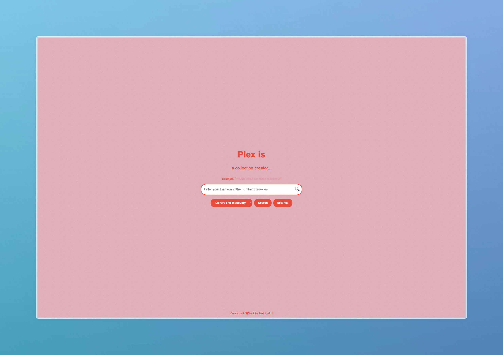

# PlexIs

PlexIs is a web application that helps you generate and manage movie collections for your Plex Media Server, using AI-powered recommendations. You can search for movies by theme, create collections, and even manage your existing collections directly from the web interface. The app supports multi-language UI and can integrate with Plex and Radarr.

---

## Features

- **AI-powered movie recommendations** based on a theme or keywords
- **Create and manage Plex collections** directly from the web UI
- **Integration with Plex and Radarr** for library and download management
- **Multi-language support** (English, French, Spanish, German, Italian, Portuguese, Pirate)
- **Customizable models** (GROQ, Ollama, or OpenAI LLM backends)
- **Compatible with Plex or Jellyfin**: Use either Plex or Jellyfin as your media server backend, switchable in settings.
- **Onboarding wizard**: Interactive setup wizard for first-time configuration on first launch.
- **Automated Radarr integration**: Add selected movies directly to Radarr from the web UI.
- **Responsive and modern UI**




---

## Getting Started

### Prerequisites
- [Docker](https://www.docker.com/) and [Docker Compose](https://docs.docker.com/compose/) installed
- A running Plex Media Server **or** Jellyfin Media Server
- A running Radarr instance for automated downloads (optional if using only Jellyfin)
- API keys for Plex, Radarr, and GROQ, Ollama, or OpenAI (depending on your chosen LLM provider)
- For Jellyfin: API key and user ID

### Installation & Launch

#### 1. Clone the repository
```bash
git clone https://github.com/JulesMellot/PlexIs.git
cd plex-recommandation
```

#### 2. Configure Environment Variables
Edit the `docker-compose.yml` file to set your Plex, Jellyfin, and Radarr URLs and API keys. Example:
```
    environment:
      # For Plex
      - PLEX_URL=http://your-plex-ip:32400
      - PLEX_TOKEN=your_plex_token
      # For Jellyfin (optional)
      - JELLYFIN_URL=http://your-jellyfin-ip:8096
      - JELLYFIN_API_KEY=your_jellyfin_api_key
      - JELLYFIN_USER=your_jellyfin_user_id
      # For Radarr (optional)
      - RADARR_URL=http://your-radarr-ip:7878
      - RADARR_API_KEY=your_radarr_api_key
      # LLM Providers
      - MODEL_SERVER=GROQ/OLLAMA/OPENAI
      - GROQ_API_KEY=your_groq_api_key
      - OLLAMA_URL=http://ollama:11434
      - OPENAI_API_KEY=your_openai_api_key
      - TZ=Europe/Paris
```
You can also configure these options via the `user_settings.json` file (see below).

#### 2a. Onboarding (Web UI)

On first launch, the app redirects to an interactive onboarding wizard at [http://localhost:9999/onboarding](http://localhost:9999/onboarding). Fill in your Plex/Jellyfin and LLM provider credentials via the web form:


#### 3. Start the Application
```bash
docker-compose up --build
```
The web server will be available at [http://localhost:9999](http://localhost:9999)

---

## Usage

1. **Access the web UI** at [http://localhost:9999](http://localhost:9999)
2. Enter a theme or keyword (e.g., "space adventure", "romantic comedies")
3. Choose the search option (library only, discovery, or mixed)
4. Click the search button to get AI-powered movie recommendations
5. Select movies and create a new Plex collection
6. Use the settings modal to adjust language, model, **LLM provider (Groq, Ollama, OpenAI)**, and **media server (Plex or Jellyfin)** preferences
7. Manage your collections from the "Manage Collections" page

---

## File Structure

- `app.py` — Main Flask application (API, business logic, integration)
- `templates/` — HTML templates for the web UI
- `static/` — JavaScript, CSS, and static assets
- `requirements.txt` — Python dependencies
- `docker-compose.yml` — Docker Compose configuration
- `Dockerfile` — Docker build instructions
- `user_settings.json` — User and app settings (now includes media server and LLM provider selection)
- `translations.py` — Multi-language translation data

---

## Settings Example (`user_settings.json`)

You can now configure the app to use either Plex or Jellyfin, and select your LLM provider (Groq, Ollama, OpenAI) directly in the settings file. Example:

```json
{
  "root_folder": "/data/FILM",
  "quality_profile": "MULTI VF VO",
  "plex_library": "Films",
  "language": "french",
  "model": "llama-3.1-8b-instant",
  "llm_provider": "groq",
  "llm_api_key": "",
  "ollama_url": "http://localhost:11434",
  "media_server": "plex", // or "jellyfin"
  "jellyfin_url": "http://localhost:8096",
  "jellyfin_api_key": "your_jellyfin_api_key",
  "jellyfin_user": "your_jellyfin_user_id",
  "radarr_url": "http://your-radarr-ip:7878",
  "radarr_api_key": "your_radarr_api_key"
}
```

- Change `media_server` to `jellyfin` and provide your Jellyfin credentials to use Jellyfin instead of Plex.
- Change `llm_provider` to `groq`, `ollama`, or `openai` and provide the corresponding API key to use your preferred LLM backend.

## Customization

- **Models:** Switch between GROQ and Ollama in settings or via environment variables.
- **Languages:** Add or edit UI translations in `translations.py`.
- **Plex/Radarr:** Adjust integration settings in `user_settings.json` or via the web UI.

---

## Troubleshooting
- Ensure your Plex and Radarr servers are reachable from the Docker container.
- Check for correct API keys and URLs in `docker-compose.yml`.
- Logs are output to the console; use `docker-compose logs` for debugging.

---

## Contributing

Contributions are welcome! If you want to add new features, fix bugs, or improve the app, follow these steps:

1. **Fork the repository** on GitHub.
2. **Clone your fork** locally:
   ```bash
   git clone https://github.com/JulesMellot/PlexIs.git
   cd PlexIs
   ```    
3. **Create a new branch** for your feature or fix:
   ```bash
   git checkout -b my-feature
   ```
4. **Make your changes**. Update code, add tests, and update documentation as needed.
5. **Commit and push** your changes:
   ```bash
   git add .
   git commit -m "Add my feature"
   git push origin my-feature
   ```
6. **Open a Pull Request** on GitHub. Describe your changes and reference any related issues.

### Guidelines
- Please write clear commit messages and document your code.
- For major changes, open an issue first to discuss what you want to change.
- Make sure your code passes existing tests and does not break the build.

Thank you for helping to improve PlexIs!

---

## License
MIT License

---

## Credits
Developed by Jules Mellot and contributors.

---

## Contact
For questions or issues, open an issue on the repository or contact the maintainer.
